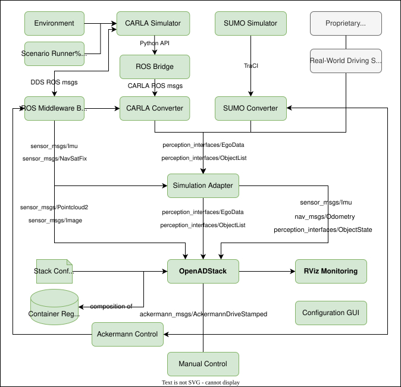
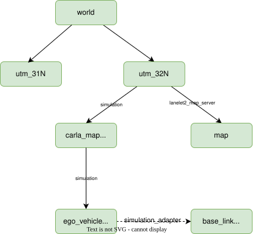

# Architecture

TEST 2

OpenADSim provides a closed-loop simulation environment for [OpenADStack](https://github.com/openads-project/openadstack). It combines interchangeable simulation backends, a backend-independent simulation interface, OpenADStack, and supporting services in a modular Docker Compose deployment.

## Architectural Principles

- [ROS 2](https://www.ros.org/) interfaces define the communication boundaries between services.
- [Docker Compose](https://docs.docker.com/compose/) orchestrates the modular services, while profiles select the simulation backend and functional capabilities.
- Simulation services and OpenADStack services are loosely coupled using common OpenADS interfaces.
- The platform aims to support multiple simulators. Currently, CARLA and SUMO are supported.
- Components are containerized to support reproducibility, isolation, and portability.

## System Architecture

The diagram above shows the data flow between the simulation backends and OpenADStack. Backend-specific interfaces, bridges, and converters provide messages such as [`perception_msgs/EgoData`](https://github.com/ika-rwth-aachen/perception_interfaces/blob/main/perception_msgs/msg/EgoData.msg) and [`perception_msgs/ObjectList`](https://github.com/ika-rwth-aachen/perception_interfaces/blob/main/perception_msgs/msg/ObjectList.msg) to the OpenADS simulation adapter, which provides ROS topics to OpenADStack. Control commands flow back to the simulator-specific control services.

Supporting services provide scenario execution, monitoring, and the Configuration GUI. The internal modules and interfaces of OpenADStack are described in its [functional architecture](https://openads-project.github.io/openadstack/openadstack/docs/functional-architecture.html).

## Simulation Backends

### Requirements

Simulation backends used with OpenADSim must support the following interfaces and runtime requirements, either directly or through adapters:

- Containerized deployment using Docker
- ROS 2 connectivity, ideally supporting `rmw_zenoh_cpp`
- Provision of the OpenADS interfaces `perception_msgs/EgoData` and `perception_msgs/ObjectList`, and optionally of raw sensor data such as `nav_msgs/Odometry`, `sensor_msgs/Imu`, `sensor_msgs/NavSatFix`, `sensor_msgs/Image`, or `sensor_msgs/PointCloud2`
- Control interfaces using `ackermann_msgs/AckermannDriveStamped`

For scenario execution, support for ASAM standards such as *OpenSCENARIO* and *OpenDRIVE* is recommended.

### CARLA: Full End-to-End Simulation

[CARLA](https://carla.org/) is used for high-fidelity closed-loop simulation with full sensor integration and scenario-based testing.

| Component | Purpose |
| --------- | ------- |
| [carla-simulator](https://github.com/openads-project/carla-simulator) | High-fidelity rendering and physics backend based on CARLA for closed-loop full-stack simulation, including perception, planning, and control. |
| [carla-ros-bridge](https://github.com/openads-project/carla-ros-bridge) | ROS 2 connection to CARLA topics and services, exposing simulator state and controls to the OpenADS ecosystem. |
| [carla-scenario-runner](https://github.com/openads-project/carla-scenario-runner) | Execution of OpenSCENARIO scenarios in CARLA for repeatable scenario-based simulation and testing. |
| [carla_converter](https://github.com/openads-project/carla_converter) | Conversion of CARLA-specific simulation outputs into OpenADS-compatible ego, object, map, and V2X topics. |
| [ros_middleware_bridge](https://github.com/openads-project/ros_middleware_bridge) | DDS-to-Zenoh bridge that connects CARLA's native ROS/DDS interface with the OpenADStack middleware. |

### SUMO: Lightweight Planning Simulation

[SUMO](https://eclipse.dev/sumo/) is used for lightweight planning-oriented simulation and large-scale traffic scenarios with low hardware requirements. The SUMO interface directly provides `EgoData`, `ObjectList`, and map information for the downstream stack.

| Component | Purpose |
| --------- | ------- |
| [sumo_interface](https://github.com/openads-project/sumo_interface) | Conversion of SUMO-specific simulation outputs into OpenADS-compatible ego, object, and map topics. |

## Simulation Adapter

The [simulation_adapter](https://github.com/openads-project/simulation_adapter) defines the connection between the simulator-specific services and OpenADStack. It provides a backend-independent interface so that downstream stack components can operate on the same topics, regardless of whether *CARLA* or *SUMO* is used. In the default configuration, the adapter transforms backend-provided `EgoData` and `ObjectList` and publishes them as `/localization/ego_state_estimation/ego_data` and `/simulation/object_list`. Alternatively, vehicle and sensor data can be forwarded for further processing in OpenADStack.

More specifically, the adapter:

- subscribes to the simulator-specific topics
- transforms messages from simulation-specific frames into the `map` and `base_link` frames used in OpenADStack
- optionally triggers automatic Lanelet2 map selection based on the selected simulation map

## Coordinate Systems and Transformations

Coordinate handling is relatively complex because the Lanelet2 map used by OpenADStack may use a different coordinate system than the simulation map. The following diagram describes the relevant simulator and OpenADStack TF frames.

