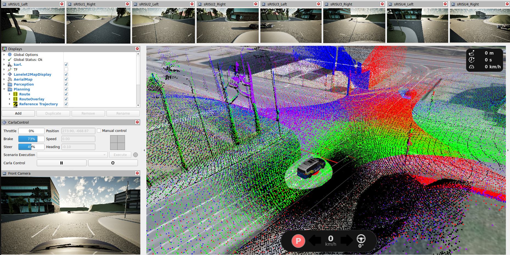

# Example: *Cooperative Perception*

Cooperative perception can extend the environment model of a vehicle beyond its own field of view by adding sensor data from other traffic participants and roadside infrastructure. This example shows the simulated version of the real-world intersection [RITA](https://www.ika.rwth-aachen.de/en/competences/equipment/infrastructure/roadside-infrastructure.html) at RWTH Aachen's Campus Melaten. Four stationary roadside infrastructure station units (sRISUs) observe the intersection from fixed masts, while the `ego_vehicle` can pass through it with its own sensor rack.

| Component | Role |
| --- | --- |
| `ego_vehicle` (`karl`) | Research vehicle with a sensor rack, controlled in closed loop by OpenADStack |
| `srisu1` … `srisu4` | Roadside units observing the intersection from four corners |

> [!IMPORTANT]
> Cooperative perception is supported only with CARLA. Make sure that the [OpenADS system requirements](https://openads-project.github.io/start/start.html#requirements) are met before starting.

## Sensor Layouts

Two layouts are available. The minimal layout spawns the physical sensor platform only at `srisu2`, reducing the runtime cost substantially. All four roadside units publish their ideal V2X object lists in both layouts.

| Layout | Lidars and cameras | V2X object lists | Use case |
| --- | --- | --- | --- |
| Minimal ([`rita-minimal.json`](../carla-simulation/config/carla_ros_bridge/objects/rita-minimal.json)) | `srisu2` only | all four units | Default, lower computational load |
| All ([`rita-all.json`](../carla-simulation/config/carla_ros_bridge/objects/rita-all.json)) | all four units | all four units | Complete sensor setup |

## Getting Started

1. Start the predefined configuration from the repository root:

   ```bash
   docker compose --env-file examples/cooperative-perception/.env up -d
   ```

   To use the full sensor layout, replace `rita-minimal.json` with `rita-all.json` in the example `.env` file.

   > [!NOTE]
   > The `ego_vehicle` remains stationary after startup by design. The `traffic` profile generates background traffic but does not assign a route to the ego vehicle. To let OpenADStack drive the ego vehicle through this traffic, use the **Plan Route** tool in RViz to set a destination.

2. Inspect the intersection in RViz. The appropriate RViz configuration is selected automatically from the sensor file. With `rita-minimal.json`, roadside camera images and point clouds are available only for `srisu2`. With `rita-all.json`, they are available for all four roadside units and can be enabled individually in the common frame alongside the ego vehicle sensors.

   <div align="center">
     
     <br>
     <em>Available point clouds in the full cooperative-perception sensor layout, including all roadside units and the <code>karl</code>.</em>
   </div>

3. In both layouts, every roadside station publishes objects within its range via its own V2X object list topic. You can view the identified objects for each station.

   

4. Stop the simulation when finished:

   ```bash
   docker compose --env-file examples/cooperative-perception/.env down
   ```

## Outlook

**Fusing the roadside data:** [`point_cloud_fusion`](https://github.com/openads-project/point_cloud_fusion) currently combines the four lidars of the ego vehicle. Since it takes an arbitrary list of input topics and transforms them into a common `target_frame`, the roadside point clouds could be early-fused in this node.

**Compliance with the ETSI-ITS standard:** The V2X object lists are published in the [`ObjectList`](https://github.com/ika-rwth-aachen/perception_interfaces/tree/main/perception_msgs/msg) format at the moment. With the [`etsi_its_messages`](https://github.com/ika-rwth-aachen/etsi_its_messages) package they can be converted into ETSI ITS Collective Perception Messages (CPM), the format real roadside stations actually broadcast. Once the object lists travel as CPMs, the simulated units become interchangeable with real ones from the perspective of the receiving stack.

**Towards the real-world testfield:** The four sRISUs are modelled after the [RITA roadside infrastructure](https://www.ika.rwth-aachen.de/en/competences/equipment/infrastructure/roadside-infrastructure.html) installed at an intersection of RWTH Aachen's Campus Melaten. Perception and fusion approaches developed in this example can therefore be carried over to the physical testfield, with the simulation serving as the place to iterate before moving to real hardware.
