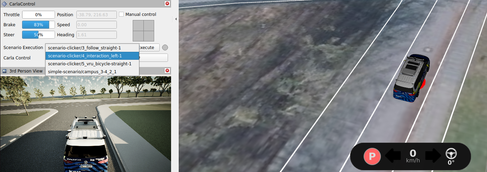

# Example: *Scenario Execution*

Scenario execution allows the behavior of a system under test, such as OpenADStack, to be assessed within a defined traffic situation. It enables reproducible functional tests, safety analyses, and regression testing.

OpenADSim separates background traffic from scenario execution through two independent profile groups:

| Group | Compose profiles | Use case |
| --- | --- | --- |
| Traffic | `no-traffic`, `traffic` | Disable or generate random background traffic |
| Execution | `no-testing`, `manual-testing`, `automated-testing` | Select scenarios in RViz or run a configured scenario automatically |

The CARLA default is `traffic` together with `manual-testing`. The scenario-execution example uses `no-traffic` together with `automated-testing` so unrelated random actors do not affect reproducible runs.

> [!IMPORTANT]
> Scenario execution using OpenSCENARIO is currently supported only with CARLA. Make sure that the [OpenADS system requirements](https://openads-project.github.io/start/start.html#requirements) are met before starting.

## How It Works

An [ASAM OpenSCENARIO](https://www.asam.net/standards/detail/openscenario-xml/) (`.xosc`) file references a map and defines participants, actions, triggers, and test end conditions. The [CARLA scenario runner](https://github.com/openads-project/carla-scenario-runner) coordinates the scenario actors while [OpenADStack](https://github.com/openads-project/openadstack) controls the `ego_vehicle` in closed loop.

The supplied scenarios assign the [`ros_vehicle_control_route_action.py`](https://github.com/openads-project/carla-scenario-runner/blob/main/srunner/scenariomanager/actorcontrols/ros_vehicle_control_route_action.py) controller to the ego vehicle. This controller forwards the route defined in OpenSCENARIO to OpenADStack and sets the initial position and speed.

OpenSCENARIO does not define test criteria, but the CARLA scenario runner evaluates `StopTrigger` conditions with predefined names, such as collision, wrong-lane, red-light, or driven-distance criteria, and prints the result through the scenario runner.

## Demo Scenarios

Demo scenarios are stored in [`carla-simulation/scenarios`](https://github.com/openads-project/openadsim/tree/main/carla-simulation/scenarios). Four use `campus`, one uses `aldenhoven`, and one uses a synthetic OpenDRIVE map. `campus` and `aldenhoven` are two of the prebuilt CARLA maps included with OpenADSim.

| Scenario | Map | Content | Source |
| --- | --- | --- | --- |
| `campus_following.xosc` | `campus` | Following a vehicle on a straight route | `scenario.generator` (will be released soon) |
| `campus_intersecting_with_vehicle_from_left.xosc` | `campus` | Interaction with a vehicle approaching from the left | `scenario.generator` (will be released soon) |
| `campus_merging_following_with_vehicle_from_right.xosc` | `campus` | Merging and following a traffic participant approaching from the right | `scenario.generator` (will be released soon) |
| `campus_turning_left.xosc` | `campus` | Ego left-turn route | [simple-scenario](https://github.com/ika-rwth-aachen/simple-scenario) |
| `atc_turn_left_intersecting_vehicle_from_left_turning_left.xosc` | `aldenhoven` | Left turn with an intersecting vehicle from the left | [simple-scenario](https://github.com/ika-rwth-aachen/simple-scenario) |
| `synthetic_curve_cut_in.xosc` | Custom `synthetic_curve_cut_in.xodr` | Vehicle cut-in on a curved road | [simple-scenario](https://github.com/ika-rwth-aachen/simple-scenario) |

The scenarios can be used as templates or replaced with compatible OpenSCENARIO files. Authoring tools such as [simple-scenario](https://github.com/ika-rwth-aachen/simple-scenario) and `scenario.generator` (will be released soon) support the creation of individual concrete scenarios. Real-world scenarios can also be explored using [scenario.center](https://scenario.center).

> [!NOTE]
> **Extending the workflow with [scenario.center](https://scenario.center/)**
>
> While the scenario generation tools above focus on individual scenarios, scenario.center covers the preceding steps of a scenario-based evaluation workflow. It derives scenario concepts from real-world traffic observations and supports scenario identification, analysis, comparison, and structured storage in a searchable database. Coverage, occurrence likelihood, and risk information help select relevant cases and build representative test catalogs. Compatible concrete OpenSCENARIO and OpenDRIVE files can then be incorporated into OpenADSim workflows.

## Import and Validate Custom Scenarios

Use **Import scenario** in the Configuration GUI to upload an `.xosc` file, plus `.xodr` and Lanelet2 `.osm` files for custom maps. **Validate and import** checks compatibility, adapts a copy for OpenADSim, and selects the imported scenario and map. In addition, all scenarios are also checked automatically before execution. For CLI usage and details, see the [scenario-checker documentation](../utils/scenario-checker/README.md).

## Manual Scenario Execution Using RViz

Manual mode lets you select, start, and repeat scenarios through RViz. OpenADStack controls the `ego_vehicle`, while the CARLA scenario runner controls the other scenario participants.

> [!IMPORTANT]
> Before starting a scenario in RViz, make sure the ego vehicle is stationary and no route is active. Ensure that OpenADStack has control and  manual control is deactivated.

1. Configure and start OpenADSim from the repository root:

   ```bash
   COMPOSE_PROFILES=carla,no-traffic,manual-testing,no-perception,planning \
   docker compose up -d
   ```

   The same profiles can alternatively be selected in the Configuration GUI.

2. In the RViz `CarlaControl` panel, choose a scenario from the drop-down list and execute it. The list only contains scenarios that match the active map. Inspect the execution in RViz and CARLA; scenarios can be selected and re-executed without restarting the complete setup.

   

3. Stop the simulation when finished:

   ```bash
   docker compose down
   ```

## Automated Scenario Execution

### Run One Scenario Automatically

The `automated-testing` profile starts `SCENARIO_FILE` immediately and reports the scenario-runner result to the console. The selected map must match `RoadNetwork/LogicFile` in the scenario.

1. Configure and start OpenADSim from the repository root:

   ```bash
   COMPOSE_PROFILES=carla,no-traffic,automated-testing,no-perception,planning \
   SCENARIO_FILE=carla-simulation/scenarios/scenario-generator/campus_following.xosc \
   MAP=campus \
   docker compose up -d
   ```

2. Follow the scenario-runner output until the test has finished:

   ```bash
   docker compose logs --follow carla-scenario-runner-ros-automated-testing
   ```

3. Stop the simulation:

   ```bash
   docker compose down
   ```

### Execute Multiple Scenarios

[`scenario-execution.py`](../examples/scenario-execution/scenario-execution.py) runs a set of `.xosc` files sequentially and restarts all Compose services between scenarios. This isolates every run and allows maps, vehicles, and sensors to vary within one testing campaign.

```bash
./examples/scenario-execution/scenario-execution.py \
  -c examples/scenario-execution/example.json
```

The required `-c FILE` provides the complete simulation environment and the repository `.env` is not loaded. Use [`example.json`](../examples/scenario-execution/example.json) as a template. Its top-level `env` applies globally, while ordered `scenario` or `match` rules override individual values. Every effective `COMPOSE_PROFILES` value must contain `carla` and `automated-testing` and must not contain `sumo` or `manual-testing`.

> [!NOTE]
> Run `./examples/scenario-execution/scenario-execution.py -h` for all available options.

For traceability, results and the effective environment are stored separately for each scenario execution:

```text
examples/scenario-execution/scenario-data/<scenario-name>__<YYYYMMDDTHHMMSSZ>/
├── environment.json  # effective JSON and runner-derived environment
├── compose.log       # complete Docker Compose output
├── scenario.log      # scenario-runner output and evaluation
├── bags/             # ROS bags, when a bag-recorder service is enabled
└── op/               # Omega-Prime output created with -o
```

The [Omega-Prime](https://github.com/ika-rwth-aachen/omega-prime) output generated by the automated scenario execution described above allows recorded runs to be validated, visualized, compared, and evaluated using interaction metrics such as PET, TTC, and THW. Omega-Prime represents dynamic objects, maps, and environmental data in a common format based on the [Open Simulation Interface](https://www.asam.net/standards/detail/osi/) and also serves as a data-compatibility layer in [scenario.center](https://scenario.center/).

## Scaling with OpenADScale

OpenADScale enables scalable, scenario-based testing of large scenario catalogs on multi-node Kubernetes clusters, as described in [*Scalable Distributed Simulation-Based Testing for Automated Driving Systems*](https://arxiv.org/abs/2608.20904). Simulation runs can be distributed across multiple machines and executed in parallel, moving beyond the local, sequential Docker Compose workflow.

> [!NOTE]
> OpenADScale is not yet publicly available. If you are interested, please contact us through [OpenADS support](https://openads-project.github.io/support/support.html).

To create these distributed simulation environments, OpenADScale uses the published OpenADService [Helm Charts](https://helm.sh/docs/topics/charts/) to deploy all services required for a simulation. [Helmfile](https://helmfile.readthedocs.io/en/stable/) combines the individual charts and their configuration into a complete, reproducible OpenADSim deployment. This makes it possible to define service versions, simulation settings, and Kubernetes resources consistently for an entire execution campaign.

[Argo Workflows](https://argoproj.github.io/workflows/) then orchestrates the campaign lifecycle on Kubernetes: it provisions an isolated simulation environment for each scenario, starts and monitors the run, collects logs and results, and releases the resources after completion.
