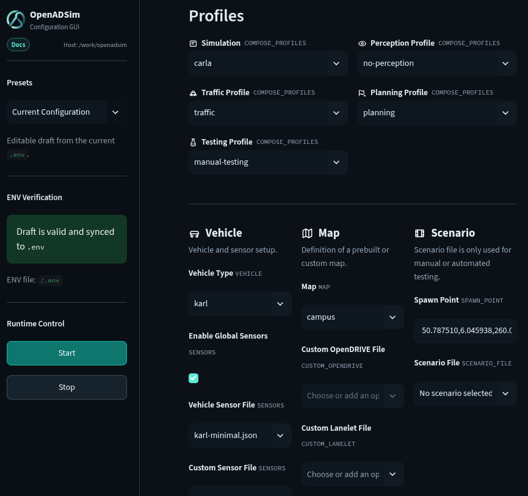
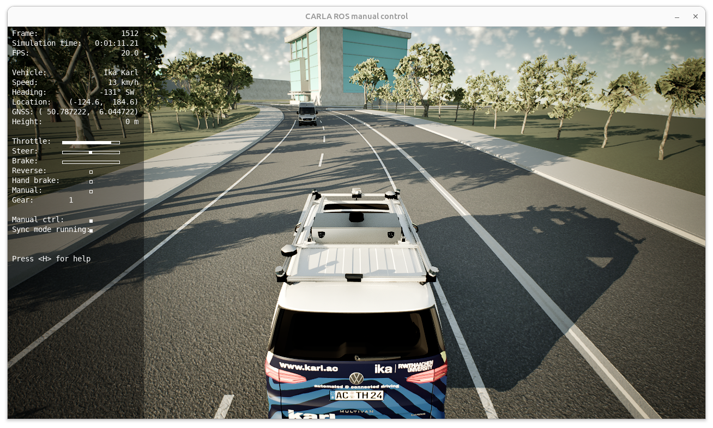
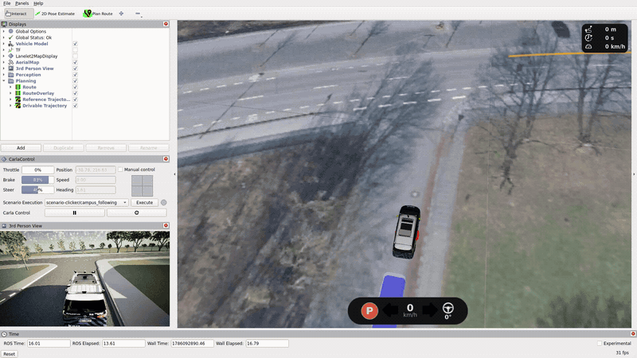

# Getting Started

OpenADSim provides a complete closed-loop simulation environment for running and evaluating [OpenADStack](https://openads-project.github.io/openadstack/openadstack.html). It combines configurable simulation backends, vehicles, sensors, maps, and scenarios in a ready-to-use Docker Compose setup.

> [!IMPORTANT]
> Make sure that the general [OpenADS system requirements](https://openads-project.github.io/start/start.html#requirements) are met.

- CARLA-based simulation requires an NVIDIA GPU, an installed NVIDIA driver, and the [NVIDIA Container Toolkit](https://github.com/NVIDIA/nvidia-container-toolkit)
- SUMO-based simulation is more lightweight and can also run without a dedicated GPU

> [!NOTE]
> Graphical applications started from containers need access to the local X server, which can be granted by running the following command in a terminal:
> ```bash
> xhost +local:
> ```

## Running OpenADSim

 

> [!NOTE]
> Run all commands from the repository root.

The repository includes a ready-to-use [`.env`](https://github.com/openads-project/openadsim/blob/main/.env) for the default setup. You only need to edit it if you want to change the simulation backend, map, vehicle, sensors, profiles, or optional example overrides. You can make changes manually or through the OpenADSim Configuration GUI, which shows the available options and validates them. See the [Configuration](configuration.md) Documentation for a compact reference.

### 1. (Optional) Customization

#### Option A: Use the Configuration GUI

```bash
docker compose up -d gui
```

This automatically starts the Configuration GUI when X11 access is available. Otherwise, open [http://localhost:8501](http://localhost:8501) manually.

The Configuration GUI can be used to:

- load predefined example presets,
- select functional profiles,
- customize vehicle, sensor, map, and scenario settings,
- validate configuration dependencies automatically, and
- save valid changes back to the `.env` file.



#### Option B: Edit `.env` File Manually

You can also edit the [`.env`](https://github.com/openads-project/openadsim/blob/main/.env) file manually. This is useful for small, targeted changes or for expert workflows where starting the Configuration GUI is not necessary.

### 2. Verify Settings

You can run OpenADSim with either CARLA or SUMO as the simulation backend. CARLA provides a high-fidelity 3D simulation and usually takes longer to start. SUMO is more lightweight and normally reaches a running state much faster.

The following `.env` snippets are minimal example configurations for each simulation backend.

For CARLA:

```bash
COMPOSE_PROFILES=carla,traffic,manual-testing,no-perception,planning
MAP=campus
SPAWN_POINT=50.787510,6.045938,260.0,90.0,wgs84 # lat, lon, altitude, heading, coord.
VEHICLE=karl
SENSORS=global-sensors.json,karl-minimal.json
USE_SIM_TIME=true
```

For SUMO:

```bash
COMPOSE_PROFILES=sumo,no-perception,planning
MAP=campus
SPAWN_POINT=50.787510,6.045938,260.0,90.0,wgs84 # lat, lon, altitude, heading, coord.
VEHICLE=karl
USE_SIM_TIME=true
```

### 3. Start the Simulation

Pull the required images and start the simulation with the current configuration:

```bash
docker compose pull
docker compose up -d
```

> [!NOTE]
> The initial image pull may take several minutes, depending on your system and internet connection.
> If pulling multiple images in parallel fails, retry the pull sequentially with `docker compose --parallel 1 pull`.

Alternatively, use the `Start` button in the Configuration GUI. Both paths use the current `.env` as input.

Once the simulation is running, two windows open:

- **RViz** is the main development view for observing the simulation and interacting with OpenADStack.
- **Manual Control** lets you drive the vehicle manually.

In RViz, you should see the selected vehicle on the selected map. CARLA may take longer to start depending on your hardware.

### 4. Drive the Vehicle Manually

You may use the `W/A/S/D` keys in the manual control window to drive the vehicle with your keyboard. You can toggle reverse driving with the `Q` key and hand back control to OpenADStack with the `B` key.



### 5. Let OpenADStack Control the Vehicle

In many setups, OpenADStack can take over control of the vehicle. For this to happen, you need to trigger route planning in RViz with the `Plan Route` tool. If activated manual driving before, press `B` in the manual control window to hand back control to OpenADStack. You can replan the route in RViz at any time.



 You can also use the `2D Pose Estimate` tool to move the vehicle to another location on the map at any time.

### 6. Stop the Simulation

Stop the simulation from the command line:

```bash
docker compose down
```

Alternatively, use the `Stop` button in the Configuration GUI.

## Common Interactions

### Execute a Specific Scenario


Use scenarios when you want to reproduce a defined traffic situation instead of driving freely or relying on random traffic. OpenADSim uses the [CARLA scenario runner](https://github.com/openads-project/carla-scenario-runner) to execute OpenSCENARIO files. It is currently only available with the CARLA backend.

1. Select `no-traffic` and `manual-testing` in the Configuration GUI or set the following values in `.env`:

```bash
COMPOSE_PROFILES=carla,no-traffic,manual-testing,no-perception,planning
```

2. Start the simulation:

```bash
docker compose up -d
```

3. Select and start the scenario through the RViz scenario control panel. Scenarios that are available for the selected map and stored in the workspace are prefiltered automatically. Details about scenario requirements and more configuration options are described in the [Scenario Execution Example](example-scenario-execution.md).


### Use a Custom Map


Custom OpenDRIVE maps are supported when using the CARLA simulation backend.

1. Place your OpenDRIVE (`.xodr`) map file inside the repository.

2. Make sure the OpenDRIVE file contains a valid geo reference.

3. Select the map in the Configuration GUI or set the following values in `.env`:

```bash
MAP=
CUSTOM_OPENDRIVE=<path-to-custom-opendrive-map>.xodr
SPAWN_POINT=
CUSTOM_LANELET=<path-to-custom-lanelet-map>.osm
LANELET_RELOAD=false
```

Leave `MAP` empty if `CUSTOM_OPENDRIVE` is set. Leave `SPAWN_POINT` empty if CARLA should choose a random spawn point, or set an explicit spawn point in map coordinates if a random one is not suitable for your map.

For OpenADStack route planning on a custom map, also provide a matching Lanelet2 map through `CUSTOM_LANELET` and set `LANELET_RELOAD=false`.

4. Start the simulation:

```bash
docker compose up -d
```

5. If the map or ego vehicle does not load, inspect the CARLA ROS bridge and lanelet map server logs:

```bash
docker compose logs -f carla-ros-bridge carla-spawn-objects localization.lanelet2-map-server
```

### Update Sensor Configuration


For CARLA, sensor layouts are configured through JSON files in `carla-simulation/config/carla_ros_bridge/objects`.

1. Duplicate an existing object configuration:

```bash
cp carla-simulation/config/carla_ros_bridge/objects/karl-minimal.json \
  carla-simulation/config/carla_ros_bridge/objects/karl-custom.json
```

2. Edit `carla-simulation/config/carla_ros_bridge/objects/karl-custom.json` and add, remove, or change sensors. Reuse sensor blueprint definitions from `carla-simulation/config/carla_ros_bridge/blueprints` where possible.

3. Select the custom sensor layout in the Configuration GUI or set it in `.env`:

```bash
SENSORS=global-sensors.json,karl-custom.json
```

4. Start the simulation so the ego vehicle is spawned with the updated sensor layout:

```bash
docker compose up -d
```

## Use Example Presets

OpenADSim includes presets for common use cases. The easiest way to use them is through the Configuration GUI, which applies the required settings automatically.

For more background and detailed instructions, see:

- [Scenario Execution](./example-scenario-execution.md)
- [Cooperative Perception](./example-cooperative-perception.md)
- [ML Planning](./example-ml-planning.md)

## Inspect a Running Container

Once the stack is running, you can open a shell inside any container that includes a ROS installation and inspect ROS topics:

```bash
docker compose exec monitoring.rviz-carla bash
```

When running the SUMO backend, use `monitoring.rviz-sumo` instead.

Inside the container, list the available ROS topics and inspect `/localization/ego_state_estimation/ego_data`, one of the central topics between the simulation backend and OpenADStack:

```bash
ros2 topic list
ros2 topic echo /localization/ego_state_estimation/ego_data
```

Leave the container shell with:

```bash
exit
```

## Development Process & Tools

For developing new modules or modifying existing OpenADS services, follow the [OpenADSuite development workflow](https://openads-project.github.io/openadsuite/openadsuite.html). It describes the recommended template repositories, development containers, release workflow, and registry artifacts used by OpenADSim.

For integrating a custom module into OpenADSim, see the [Custom Integration](custom-integration.md) guide. Additional helper tools are documented in the [OpenADSuite tools overview](https://openads-project.github.io/openadsuite/tools.html).

## System Analysis & Tracing

For runtime analysis, tracing, and performance inspection, see the [OpenADSuite analysis guide](https://openads-project.github.io/openadsuite/analysis.html). It explains how tracing data can be generated and used to understand timing behavior across the distributed ROS 2 stack.
